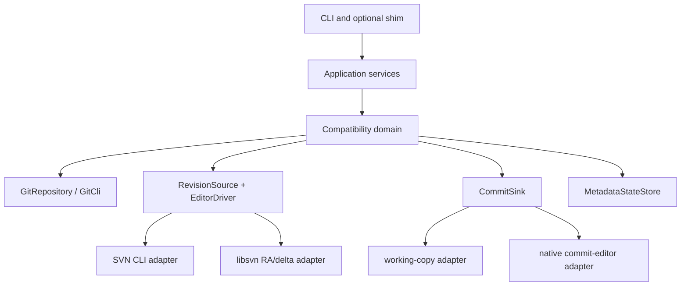

# git-svn-rs Architecture Roadmap v2

## Role of This File

This is the architecture bus and execution order for the phase plans. Phase 9 closes
the first release gates; Phase 10 separately owns post-release maintainability and
package readiness. The product contract is `.plans/git-svn-rs-plan.md`; the
evidence-backed correction is
`.plans/git-svn-rs-plan-code-architecture-review-2026-07-10.md`.

Old task-by-task recipes were removed because they mixed specification, sample implementation, and stale completion checkboxes. Current phase files define outcomes and gates; implementation details are chosen only after a failing compatibility test or a documented design decision.

## Frozen Upstream Baseline

- Git tag: `v2.54.0`
- Commit: [`0b13e48a3a30cdfa94e8ef842e24d6045ab3d015`](https://github.com/git/git/tree/0b13e48a3a30cdfa94e8ef842e24d6045ab3d015)
- Online latest documentation is advisory, not normative.
- A forward-compatibility change must identify the newer Git commit, describe the behavior difference, and add a versioned test.

## Upstream Responsibility Map

| Upstream source | Normative responsibility | Rust compatibility unit |
|---|---|---|
| [`git-svn.perl`](https://github.com/git/git/blob/0b13e48a3a30cdfa94e8ef842e24d6045ab3d015/git-svn.perl) | command/option surface, dispatch, command glue | `cli`, application commands |
| [`Git.pm`](https://github.com/git/git/blob/0b13e48a3a30cdfa94e8ef842e24d6045ab3d015/perl/Git.pm) | Git wrapper, config cardinality, pipe/error, prompt, temp/lock | `GitCli`, config access, error model |
| [`Git::SVN.pm`](https://github.com/git/git/blob/0b13e48a3a30cdfa94e8ef842e24d6045ab3d015/perl/Git/SVN.pm) | metadata, dates, revision ranges, commit creation, rev_map coordination | import coordinator, metadata state |
| [`GlobSpec.pm`](https://github.com/git/git/blob/0b13e48a3a30cdfa94e8ef842e24d6045ab3d015/perl/Git/SVN/GlobSpec.pm) | mapping glob/brace/depth rules | `GlobSpec`, `RefMapping` |
| [`Utils.pm`](https://github.com/git/git/blob/0b13e48a3a30cdfa94e8ef842e24d6045ab3d015/perl/Git/SVN/Utils.pm) | canonical path/URL and URL path joining | URL/session path model |
| [`Ra.pm`](https://github.com/git/git/blob/0b13e48a3a30cdfa94e8ef842e24d6045ab3d015/perl/Git/SVN/Ra.pm) | RA sessions, bounded logs, update/switch, auth, branch discovery | `RaSession`, revision source/driver |
| [`Fetcher.pm`](https://github.com/git/git/blob/0b13e48a3a30cdfa94e8ef842e24d6045ab3d015/perl/Git/SVN/Fetcher.pm) | delta consumer, filters, properties, checksums, absent paths, placeholders | `SvnFetchEditor` |
| [`Editor.pm`](https://github.com/git/git/blob/0b13e48a3a30cdfa94e8ef842e24d6045ab3d015/perl/Git/SVN/Editor.pm) | Git diff planning and SVN commit editor | `DcommitPlan`, commit sinks |
| [`Log.pm`](https://github.com/git/git/blob/0b13e48a3a30cdfa94e8ef842e24d6045ab3d015/perl/Git/SVN/Log.pm) | log/find-rev formatting and selection | readonly query/formatter |
| [`Migration.pm`](https://github.com/git/git/blob/0b13e48a3a30cdfa94e8ef842e24d6045ab3d015/perl/Git/SVN/Migration.pm) | legacy layouts, one-way migration, warnings | metadata migration policy |
| [`Prompt.pm`](https://github.com/git/git/blob/0b13e48a3a30cdfa94e8ef842e24d6045ab3d015/perl/Git/SVN/Prompt.pm) | simple auth, SSL trust, client certificate | auth provider/prompt port |

## Target Architecture



The names are conceptual boundaries, not a requirement to add a trait for every box. A boundary is introduced only when it isolates two real adapters, a persistence transaction, or unsafe FFI.

## Non-Negotiable Architecture Rules

1. **One fetch behavior model.** Transport adapters may differ; only `SvnFetchEditor` defines SVN-to-Git semantics.
2. **One dcommit plan.** Mock, working-copy, and native commit paths execute the same ordered plan.
3. **One resolver.** Remote, ref, UUID, rev_map, URL, and first-parent selection are centralized and fail on ambiguity.
4. **One metadata state boundary.** Open-read, create, lock, append, ref CAS, validation, and recovery are explicit operations.
5. **Exact identity is behavior.** Timestamp, timezone, identities, parents, messages, trees, and modes are not golden-test noise.
6. **No inert CLI.** Parse-only coverage never counts as implementation.
7. **No panic across FFI.** C callbacks translate failure to SVN errors and use operation-owned batons.
8. **No release by skip.** Dependency-skipped compatibility tests can pass only the developer gate.

## Status Model

Each phase has exactly one current state: `not-started`, `in-progress`, `structural-pass`, `behavior-pass`, or `release-pass`. Profile-specific qualification may be added, for example `behavior-pass(file://-cli)`.

Audited state reconciled on 2026-08-31. The old July implementation snapshot is
superseded by the [progress record](implementation-progress-record.md).

| Phase | State for declared profiles | Scope boundary |
|---|---|---|
| 1 workspace/CLI | `release-pass` | unsupported commands/options fail explicitly |
| 2 config/mapping | `release-pass` | broader remote/platform profiles remain deferred |
| 3 metadata/rev_map | `release-pass` | legacy metadata is inspected/rejected, not automatically migrated |
| 4 SVN backend | `release-pass` for CLI and linked read/import | native write-back remains deferred |
| 5 clone/fetch | `release-pass` | covered shared replay and exact graph/state comparisons |
| 6 readonly | `release-pass` for the documented subset | full Log.pm and broader terminal fidelity remain deferred |
| 7 dcommit | `release-pass` for safe-linear profiles | SVN CLI write sink, including linked builds |
| 8 golden/release | `release-pass` | frozen 41-scenario and required-summary gate |
| 9 hardening | `release-pass` for P0/P1 | maintenance scope completed separately in Phase 10 |
| 10 maintainability/package | `release-pass` at `ffb2e22` | package readiness, not registry publication |

The last proven protected release SHA is `ffb2e22` (run #33155854101). Maintenance
HEAD `4b49af6` additionally passed Windows #23 and Developer gate #11; the Windows
strict step was skipped. These results do not transfer release evidence across
SHAs. Exact commands, run links, and deferred scope remain in the progress record.
The progress record may move a state only when it cites the exact gate command
and result.

## Capability Matrix

| Profile | Read target | Write target | Required gate before support claim |
|---|---|---|---|
| `file://` + SVN CLI | single-path and stdlayout | linear dcommit | strict Perl graph/state/write comparison |
| local `svn://` + SVN CLI | explicit/authenticated fetch | authenticated linear dcommit | strict fixture comparison and recovery scenarios |
| linked libsvn `file://`/`svn://` | true RA delta through the shared editor | CLI sink only; native sink deferred | linked parallel/serial and post-submit verification gates |
| `http://`/`https://` | authenticated loopback DAV, CLI and linked | CLI working-copy sink | validated loopback fixtures; no arbitrary remote infrastructure claim |
| `svn+ssh://` | configured tunnel and real loopback OpenSSH | CLI working-copy sink | repeatable configured/loopback fixtures; broader profiles deferred |
| `mock://` | test only | test only | never user-facing support |

## Corrected Execution Order

### Stage 0: Contract and Status Reset

Covered by this roadmap and the v2 phase plans.

Exit conditions:

- baseline is pinned;
- capability and state vocabularies are present;
- every phase has behavioral and release gates;
- stale completion claims are removed from the progress record.

### Stage 1: Core Identity and Clone Closure

Primary phases: 1, 2, 3, 5, and 8.

Order:

1. URL/session/repository-relative path model;
2. single-subdirectory clone/fetch;
3. SVN date and `--localtime` object identity;
4. default checkout and `--no-checkout`;
5. revision forms and explicit inert-option rejection;
6. exact graph/working-tree golden artifacts.

Exit condition: single-path and stdlayout `file://` clones match the frozen baseline in graph, refs, metadata, HEAD, local branch, and working tree.

### Stage 2: Fetch Model Unification

Primary phases: 4 and 5.

Order:

1. move native update adapter out of tests;
2. replace global FFI recorder state with operation batons;
3. make default parallel linked tests stable;
4. route both CLI and libsvn through the same editor contract;
5. add windowing, checksum, absent, property log, pathname encoding, placeholder persistence, and follow-parent behavior;
6. remove direct log-to-Git production behavior.

Exit condition: default and linked adapters produce the same exact Git graph for the same supported fixture.

### Stage 3: Safe Dcommit

Primary phases: 3 and 7.

Order:

1. first-parent target resolver with UUID/root/path validation;
2. dirty/stale/merge preflight before any SVN write;
3. full message/author semantics;
4. shared `DcommitPlan` for mock and production sinks;
5. property deletion and operation-order parity;
6. partial-success journal and idempotent resume;
7. protocol/auth expansion only after the safety gate.

Exit condition: wrong-target, dirty-tree, unsupported merge, full-message, A/M/D/C/R/T, property, partial failure, fetch, and rebase tests pass against real SVN and the frozen baseline.

### Stage 4: Readonly and Metadata Completion

Primary phases: 3 and 6.

- scoped `find-rev` with optional tree-ish;
- shared multi-remote resolver;
- remaining `Log.pm` modes;
- migration backup/warning or explicit rejection;
- `noMetadata` one-shot limitations;
- reset/rebase recovery behavior.

### Stage 5: Strict Release Gate

Primary phase: 8.

- no Perl/SVN/libsvn/profile skip;
- exact object graph and clone state;
- profile matrix execution;
- linked tests pass in default parallel mode and a serial diagnostic job;
- release documentation names all deferred capabilities.

## Phase Dependencies

```text
Phase 1 ─┬─> Phase 2 ─┬─> Phase 5 ─┬─> Phase 6
         │            │            └─> Phase 7
         └─> Phase 3 ─┘                 │
Phase 4 ───────────────> Phase 5 ───────┤
                                        └─> Phase 8
```

- Phase 5 cannot pass before Phase 2 URL semantics and Phase 3 metadata state are behavior-ready.
- Phase 7 cannot pass before the shared resolver and fetch synchronization are behavior-ready.
- Phase 8 may build fixtures early but cannot reach release-pass before every declared profile gate.

## Gate Definitions

### Structural gate

- types and module boundaries compile;
- isolated unit tests pass;
- no production support claim is made.

### Behavioral gate

- user-facing scenario runs with real Git/SVN tooling;
- semantic assertions include failure behavior and persistent state;
- no relevant artifact is normalized away;
- required external tool actually ran.

### Release gate

- frozen Perl baseline comparison runs without skip;
- required protocol profiles run;
- object graph, metadata, worktree, output, and recovery match;
- format/lint/default/linked builds all pass.

## Verification Commands

Developer gate:

```powershell
cargo fmt --all -- --check
cargo test --workspace
cargo clippy --workspace --all-targets --all-features -- -D warnings
```

Linked backend gate uses the documented vcpkg environment and runs both default parallel and serial diagnostic forms:

```powershell
cargo test -p git-svn-rs-core --features svn-libsvn
cargo test -p git-svn-rs-core --features svn-libsvn -- --test-threads=1
```

Strict release gate:

```powershell
powershell -ExecutionPolicy Bypass -File scripts\verify.ps1 -StrictCompat
```

The strict command is a pass only if its output records that Perl `git-svn`, SVN CLI, linked libsvn, and every required scenario executed.

## libsvn Binding Decision

Before expanding handwritten FFI, record an ADR comparing current bindings with [`subversion` 0.1.10](https://docs.rs/subversion/0.1.10/subversion/) and [`subversion-sys`](https://docs.rs/subversion-sys/latest/subversion_sys/):

- required RA/delta/auth coverage;
- Windows/vcpkg build behavior;
- pool and callback lifetime safety;
- error-chain fidelity;
- maintenance cost and ABI/version validation.

The decision may retain handwritten FFI, adopt the safe crate, or use a narrow hybrid. It must not be inferred from the existing implementation.

## Execution Rules

- Read `.plans/implementation-progress-record.md` before implementation.
- Start from the highest-priority unmet behavioral gate, not the next unchecked code task.
- Add the failing compatibility test before changing semantics.
- Keep changes scoped to one gate and record final evidence only.
- Do not mark a phase complete while a required path remains mock-only, log-replay-only, skipped, or normalized away.
- Do not expand commands or protocols while a P0 correctness or target-safety gate is open.
