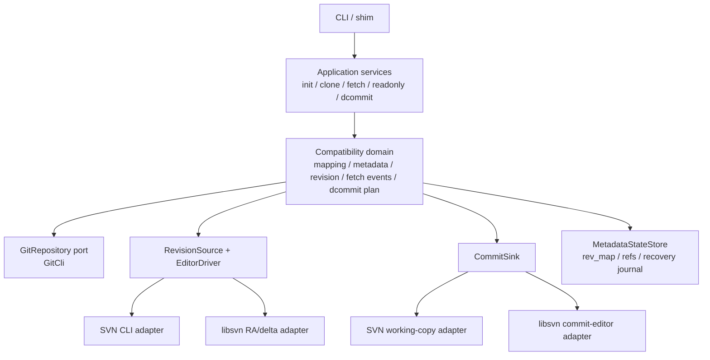

# git-svn-rs 计划、执行记录、代码与架构审查报告

审查日期：2026-07-10  
审查分支：`codex-execute-git-svn-rs-plans`  
审查基线：`b86e4f2cc47338f3290025038f31edf03b27ffab`（`docs: record native incremental delta progress`）  
审查性质：只读设计与代码审查；除本报告外未修改业务代码  

## 1. 审查目标与范围

本次审查回答四个问题：

1. 当前计划的设计是否合理，按计划执行能否达成“核心 `git svn` 闭环替代品”的目标。
2. 计划是否正确吸收了其中列出的参考文档和上游代码，而不是只做了名称映射。
3. 当前代码和执行记录是否偏离计划，执行状态是否被高估。
4. 当前架构是否适合作为后续真实 libsvn、远端 dcommit、完整只读命令和严格兼容测试的扩展基础。

审查了以下本地资料：

- `.plans/git-svn-rs-plan.md`
- `.plans/00-git-svn-rs-review-and-roadmap.md`
- `.plans/01-foundation-cli-workspace.md` 至 `.plans/08-compatibility-golden-tests.md`
- `.plans/implementation-progress-record.md`
- `.ai/guildlines.md`
- 三个 workspace crate 的生产代码、集成测试、golden harness、构建脚本和 CI/验证脚本

外部基线包括：

- [git-svn 官方文档](https://git-scm.com/docs/git-svn.html)
- [git-svn.perl](https://github.com/git/git/blob/master/git-svn.perl)
- [Git.pm](https://github.com/git/git/blob/master/perl/Git.pm)
- [Git::SVN.pm](https://github.com/git/git/blob/master/perl/Git/SVN.pm)
- [Ra.pm](https://github.com/git/git/blob/master/perl/Git/SVN/Ra.pm)
- [Fetcher.pm](https://github.com/git/git/blob/master/perl/Git/SVN/Fetcher.pm)
- [Editor.pm](https://github.com/git/git/blob/master/perl/Git/SVN/Editor.pm)
- [Log.pm](https://github.com/git/git/blob/master/perl/Git/SVN/Log.pm)
- [Migration.pm](https://github.com/git/git/blob/master/perl/Git/SVN/Migration.pm)
- [Prompt.pm](https://github.com/git/git/blob/master/perl/Git/SVN/Prompt.pm)
- [Utils.pm](https://github.com/git/git/blob/master/perl/Git/SVN/Utils.pm)
- [GlobSpec.pm](https://github.com/git/git/blob/master/perl/Git/SVN/GlobSpec.pm)
- [`subversion` 0.1.10 文档](https://docs.rs/subversion/latest/subversion/)
- [`subversion-sys` 文档](https://docs.rs/subversion-sys/latest/subversion_sys/)

说明：计划中的 GitHub 链接大多指向 `master`，并不是不可变规格。本报告按 2026-07-10 可见内容审查；后续应固定 Git tag 或 commit。

## 2. 执行摘要

### 2.1 总结论

计划的总体分层方向合理，但当前计划和实现都尚不能支撑“核心兼容替代品已达成”的结论。

当前代码更准确的定位是：

> 一个具有较多兼容基础设施、能完成本地标准布局 SVN CLI 导入和部分本地写回的实验性实现；它还不是可以替代核心 `git svn` 工作流的兼容实现。

目标仍然可达成，但需要先重设验收基线并处理 P0/P1 问题，而不是直接沿着进度记录继续堆叠 libsvn callback。当前最大的风险不是“功能数量不够”，而是以下三种系统性偏差：

- 兼容对象身份错误：导入提交时间错误，导致 Git commit ID 从根本上无法与 Perl 实现一致。
- 用户闭环未闭合：基本单路径 clone 失败；可工作的标准布局 clone 也不会建立本地分支或工作树。
- 验收门禁失真：strict Perl 对比在当前环境跳过，且 golden harness 主动抹除了 commit ID、时间和 clone 输出差异。

### 2.2 评估概览

| 维度 | 结论 | 主要原因 |
|---|---|---|
| 计划总体方向 | 基本合理 | 上游模块责任映射、阶段依赖、Git/SVN 边界、golden-first 原则正确 |
| 计划规格完整性 | 不足 | 缺少固定兼容版本、协议能力矩阵、状态不变量、失败恢复和 checkout/时间身份规格 |
| 计划可达成性 | 有条件可达成 | 必须先修正基础语义和验收门禁；照现有 checkbox 流程继续不能保证达成 |
| 代码与计划一致性 | 明显偏移 | 默认 fetch 和真实 dcommit 都绕过计划指定的行为模型；libsvn 真 delta adapter 仍仅在测试内 |
| 当前架构合理性 | 局部合理 | crate/module 边界有基础，但生产行为双轨、巨型 FFI 文件、重复配置读取和字符串错误限制扩展 |
| 当前发布就绪度 | 不具备 | P0 用户流程错误、错误对象时间、wrong-target dcommit 风险、strict gate 未执行 |

### 2.3 应立即调整的状态表述

`.plans/implementation-progress-record.md:11` 的状态不应再表述为“Phases 1-3 complete”。建议改为：

- Phase 1：结构完成，CLI 语义未完成。
- Phase 2：基础单元完成，布局/URL/metadata options 兼容未完成。
- Phase 3：rev_map primitive 完成，迁移和跨状态一致性未完成。
- Phase 4/5：本地标准布局的两种 replay 原型可用，统一生产 delta 路径未完成。
- Phase 6：supported subset 可用，multi-ref/Log.pm 完整兼容未完成。
- Phase 7：本地 working-copy write-back 原型可用，计划要求的生产 commit editor 路径未完成。
- Phase 8：harness 已建立，严格兼容 gate 未通过。

## 3. 计划设计审查

### 3.1 合理的设计决策

以下方向与上游实现一致，值得保留：

1. **以兼容单元而不是命令数量组织工作。** `.plans/00-git-svn-rs-review-and-roadmap.md:13-26` 将 `GlobSpec`、URL、rev_map、RA、Fetcher、Editor、Log、Migration、Prompt 分开映射，优于把所有行为塞进 CLI command。
2. **Git 侧使用 Git CLI。** `.plans/git-svn-rs-plan.md:14-15` 的选择能更贴近 Git 当前对象格式、config 和 plumbing 行为，也避免重新实现 Git 仓库语义。
3. **明确 `FastImport` 只是 writer。** `.plans/git-svn-rs-plan.md:20` 和 roadmap `:30-33` 正确指出 SVN 行为应来自 `SvnFetchEditor`，这与 `Ra.pm` 驱动 `Fetcher.pm` 的方式一致。
4. **dcommit 使用 editor-driven path。** roadmap `:95-103` 对 `diff-tree -z -r -C`、path preflight、operation ordering 和 commit editor 的抽象方向正确，和 `Editor.pm` 一致。
5. **默认构建与兼容构建分离。** developer mode 可 skip、release mode 不可 skip 的原则是合理的；问题在于当前没有真正执行 release gate。
6. **rev_map 单独封装。** SHA-1/SHA-256 record size、网络序 revision、锁和 fsync 都有独立测试，这部分基础设计较扎实。
7. **保守限定 v1 写回范围。** 不在首版实现 branch/tag write-back、自动 mergeinfo、`set-tree`，有利于控制复杂度。

### 3.2 计划自身的缺陷

#### 3.2.1 兼容基线不可复现

计划链接到 Git `master` 和 latest docs，没有固定 Git tag、commit、Perl 模块摘要或测试环境版本。上游行为变化后，同一份计划会对应不同规格。

建议固定：

- 一个 Git release/tag 作为行为规格，例如与验证环境一致的 `v2.54.0`；
- 一个单独的“forward-compat”任务对比最新 Git；
- fixture 和报告中记录 Git commit、Perl `git svn --version`、SVN/libsvn version。

#### 3.2.2 “支持”没有协议和能力边界

计划写“核心闭环”，但没有按 `file://`、`svn://`、`http://`、`https://`、`svn+ssh://` 列出 read、auth、prompt、write、commit-url、strict-validation 能力。结果是代码可以“接受”某个 scheme，但不代表真实验证或可写。

建议把每项能力标成：`unsupported`、`accepted-unvalidated`、`locally-validated`、`strict-compatible`，避免使用笼统的“支持”。

#### 3.2.3 缺少 Git 对象身份规格

计划要求比较 ref 和对象，却没有把以下内容列为 Phase 5 gate：

- SVN timestamp 到 Git author/committer timestamp 的转换；
- UTC 与 `--localtime` offset；
- author/committer identity；
- parent graph；
- full commit message 和 footer；
- tree ID/file mode；
- clone 后 HEAD、local branch 和 working tree。

这是当前时间戳与 checkout 缺陷能长期通过测试的直接原因。

#### 3.2.4 缺少状态不变量和失败恢复设计

计划分别写了 fast-import、ref、rev_map，却没有规定跨组件原子性：

- ref 已前进但 rev_map 写失败时如何恢复；
- rev_map 已追加但 fetch 中断时如何校验；
- dcommit 已向 SVN 提交一个或多个 revision、后续 fetch/rebase 失败时如何续跑；
- ambiguous UUID/rev_map/remote 时是否必须 fail closed。

兼容工具处理的是长期仓库状态，这些不是优化项，应属于 Phase 3/5/7 gate。

#### 3.2.5 分计划过度依赖玩具代码片段

例如 `.plans/05-import-clone-fetch.md:212-326` 的早期 `ImportPlanner` 示例直接使用 `timestamp: 0`；后续虽要求用 Fetcher 替代行为模型，却没有新增真实时间验收。计划能驱动“测试变绿”，但测试本身不足以证明 stated goal。

#### 3.2.6 阶段门禁和开发门禁混为一谈

“依赖缺失可 skip”适用于开发反馈，不适用于宣布 Phase 8 完成。应区分：

1. unit/dev gate：外部依赖可以显式 skip；
2. backend integration gate：SVN CLI/libsvn 必须实际运行；
3. compatibility/release gate：Perl 对比不可 skip，目标协议矩阵必须跑完。

#### 3.2.7 计划状态不可维护

九个分计划目前共有 190 个 `- [ ]`，`- [x]` 为 0，而进度记录又称多个 phase 完成。计划文件实际上同时扮演“规格、教程、执行 checklist、历史记录”四种角色，状态必然漂移。

建议：计划作为不可变规格；另建精简 phase matrix 跟踪 `not-started/in-progress/structural-pass/behavior-pass/release-pass`，执行记录只保留证据和 commit anchor。

#### 3.2.8 libsvn 依赖决策没有 ADR

顶层计划要求优先 `subversion` crate，不足处再用 `subversion-sys`，并把 unsafe 隔离在 `svn_ffi`。当前实现改为 vcpkg + 手写 C FFI。这个选择可能有历史原因，但没有 Architecture Decision Record。

截至审查日，`subversion` 0.1.10 文档已经列出 RA、delta/editor、auth 和 URI 模块。不能据此直接断言应重写，但必须做一个短期 spike，比较：

- 需要的 callback surface 是否完整；
- Windows/vcpkg 支持；
- error chain、pool lifetime 和 auth provider；
- 继续维护 4,131 行手写 FFI 的成本。

## 4. 上游参考与当前实现对照

| 上游责任 | 上游关键行为 | 计划映射 | 当前实现结论 |
|---|---|---|---|
| `git-svn.perl` | CLI options、dispatch、clone/fetch/dcommit glue | `cli.rs`、commands | 命令形状基本存在，但多项已接受 option 不生效 |
| `Git.pm` | Git command wrapper、config 单/多值、prompt、pipe/error | `GitCli` | 基础 wrapper 可用；trait 太窄，structured error/prompt/temp lock 未达计划 |
| `Git::SVN.pm` | metadata、rev_map、commit creation、date、revision args | config/import/rev_map | rev_map primitive 较好；timestamp、revision keyword、metadata options 不兼容 |
| `Ra.pm` | windowed `get_log`，再由 `do_update/do_switch` 驱动 editor | `RaSession`、fetch loop | `log-window-size` 未使用；默认 CLI 绕过 editor；libsvn public `do_update` 仍是 log replay |
| `Fetcher.pm` | delta callbacks、base checksum、absent、props、path encoding、placeholder state | `SvnFetchEditor` | 只覆盖 add/delete/fulltext 和 executable/special；其余大量语义缺失 |
| `Editor.pm` | raw diff records、path type preflight、commit editor、operation order | dcommit planner/editor | mock path使用；真实 file/svn write-back绕过这些单元 |
| `Log.pm` | log/find-rev/range/format modes | formatter/readonly commands | supported subset 可用；multi-ref scope 和 tree-ish 不完整 |
| `Migration.pm` | v0-v5 layout、自动/单向迁移、warning | `migration.rs` | 只检测 `.rev_db`/`.rev_map`，没有迁移或 warning policy |
| `Prompt.pm` + `Git.pm::prompt` | simple、askpass、terminal、SSL trust、client cert | `AuthPrompt` | 只有 mock simple prompt；command path没有真实 prompt provider |
| `Utils.pm` | SVN canonical URL/path、percent encoding | `path_url.rs` | 字符串 split/trim 实现过于简单，未用于统一 URL 解析 |

## 5. 代码与计划偏移：按优先级排序

优先级定义：

- **P0**：阻止核心目标成立，或存在把提交写到错误 SVN 目标的安全风险。
- **P1**：关键兼容/架构缺陷，继续扩展前应修复。
- **P2**：中期可维护性或边界完整性问题。

### F-01 [P0] 默认单路径 URL clone 失败

**证据**

- 官方基础用法直接使用 `git svn clone .../project/trunk`；布局参数也允许相对路径或 full URL。
- `SvnCliBackend::log()` 在 `crates/git-svn-rs-core/src/svn/cli.rs:217-255` 获取 repository-root-relative changed path。
- `cat()`/`versioned_url()` 在同文件 `:120-129`、`:186-193` 又把该路径拼到已包含 `/trunk` 的 session URL。
- 本次临时仓库复现：`git-svn-rs clone file:///.../repo/trunk ...` 读取 `/trunk/hello.txt` 时请求了 `/trunk/trunk/hello.txt`，报 `W160013 path not found`。
- `strip_prefix_for()` 在 `import.rs:899-911` 对空 mapping 从完整 URL 字符串推导路径，也会把 `file:///C:/.../repo/trunk` 的本地仓库位置误当 SVN repository-relative prefix。

**影响**

最基本、最常见的 single-path core workflow 在默认构建不可用，因此不能称 clone 闭环已完成。

**建议验收**

- 分离 `repository_root_url`、`session_url`、`session_relpath` 和 `mapping_path`，禁止字符串猜测。
- 增加 root URL、subdirectory URL、full `-T/-b/-t` URL 的 file/svn/http adapter contract tests。

### F-02 [P0] 所有导入提交使用序号时间，Git 对象身份必然错误

**证据**

- `RevisionEvent.timestamp` 已由 SVN CLI/libsvn读取，但 `import.rs:137-167` 和 `:199-227` 都写 `timestamp: index as i64`。
- `fast_import.rs:36-46` 把该数值同时写成 author/committer epoch，并固定 `+0000`。
- 上游 `Git::SVN.pm::set_commit_header_env` 使用 SVN log date 设置 author/committer date；官方 `--localtime` 还要求正确处理本地 offset。
- 本次标准布局复现：SVN r2 时间为 `2026-07-10T08:22:56.007259Z`，Rust remote tip 为 epoch `1`，即 `1970-01-01T00:00:01Z`。

**影响**

- 每个 commit ID 都与 Perl `git svn` 不同；
- `git log` 时间错误；
- `--localtime` 不可能生效；
- 当前 strict object comparison 即使启用也无法通过。

**建议验收**

- 使用经过测试的 SVN ISO-8601 parser；保存 epoch 与 offset，而不是丢掉时区。
- golden capture 比较 `%H %P %T %an %ae %aI %cn %ce %cI %B`。

### F-03 [P0] clone 后没有本地分支、HEAD commit 或工作树

**证据**

- `commands/clone.rs:4-17` 只调用 init + fetch。
- `CloneArgs.no_checkout` 只在 `cli.rs:119-120` 声明，生产代码从未读取。
- 官方基础示例明确说明 clone 后应位于 master；`--no-checkout` 应改变默认 checkout 行为。
- 本次标准布局复现：`HEAD_SYMBOLIC=master`，但 `git rev-parse --verify HEAD` 退出 128；工作树为空，只有 `refs/remotes/origin/trunk` 存在。

**影响**

用户无法在 clone 后直接工作，`--no-checkout` 与默认行为完全相同，核心闭环不成立。

**建议验收**

- 默认 clone 创建/更新本地分支并 checkout 目标 tree；`--no-checkout` 仅跳过工作树 checkout。
- 覆盖 single-path、stdlayout、已有目标目录和空历史。

### F-04 [P0] dcommit resolver 可能选择错误 SVN 分支

**证据**

- `commands/resolver.rs:32-89` 固定读取 remote `svn`。
- 当多个 tracking ref 都是 HEAD ancestor 时，`:111-119` 用各自最大 SVN revision 作为分数，选择 revision 数字更大的 ref。
- 官方文档规定 merge 后 dcommit 目标来自 first-parent 上最近的 `git-svn-id`，即 `git log --grep=^git-svn-id: --first-parent -1`。

**反例**

HEAD 的 first parent 来自 branch A/r100，同时 merge 过 branch B/r200。两个 tracking ref 都是 ancestor；当前代码会因 200 大于 100 选择 B，可能把 A 的提交写到 B。

**影响**

这是写入错误远端路径的数据安全问题，必须 fail closed。

**建议验收**

- 从 HEAD first-parent chain 解析最近有效 footer/rev_map record；
- 校验 remote、UUID、repository root、SVN path 和 configured mapping 一致；
- 多个 UUID/rev_map 候选必须报 ambiguity，不能返回目录遍历中的第一个文件。

### F-05 [P0] Golden gate 无法证明计划要求的对象兼容

**证据**

- 计划 `.plans/git-svn-rs-plan.md:30` 明确要求比较“ref 名和对象”。
- `GoldenComparisonArtifacts.refs` 只有 ref name，没有 tip ID（`tests/golden/fixtures.rs:94-123`、`:863-871`）。
- rev_map artifact 只保留 revision、UUID 和 `has_commit`，丢掉 object ID（`:1658-1707`）。
- `find-rev` 把任何十六进制输出归一为 `<commit>`（`:1459-1467`）。
- clone stdout/stderr 无条件归一为 `clone: success`（`:1916-1919`）。
- log normalization 丢掉日期、作者、commit ID 等关键字段。
- 当前环境没有 Perl `git-svn`；focused test 输出 `skipping: Perl git-svn is required`，但 test 结果仍为 PASS。

**影响**

F-02/F-03 这样的根本差异不会触发 Phase 8 失败。当前“broad golden harness”成立，但“strict compatibility pass”不成立。

**建议验收**

- 比较 ref tip、完整 commit graph fingerprint、rev_map object ID、真实 clone branch/HEAD/worktree。
- 只归一化 fixture 根 URL、平台路径分隔符和明确的非语义噪声。
- release CI 必须有一个不可 skip 的 Perl job，并单独展示执行场景数。

### F-06 [P1] fetch 有两个生产行为模型，违背架构总线

**证据**

- `commands/fetch.rs:116-130`：默认 `SvnCliBackend` 调 `import_mock_revisions()`，linked libsvn 才调 `import_ra_revisions()`。
- 测试直接把两者命名为 `log-replay` 与 `ra-editor`（`:80-86`、`:398-407`）。
- 默认路径在 `import.rs:119-178` 从 enriched log snapshot 直接产生 `FileChange`。
- linked 路径才在 `import.rs:180-262` 驱动 `SvnFetchEditor`。
- 上游 `Ra.pm` 的 fetch loop 分窗口 `get_log`，随后用 `do_update/do_switch` 驱动 `Fetcher.pm`；plan `:20` 也明确禁止 parallel shortcut。

**影响**

properties、copy、filter、empty-dir、path encoding 和 error semantics 被实现两遍；default 和 linked build 会继续产生不同 Git 历史。

**建议验收**

保留多个 transport adapter，但只保留一个 import behavior model。若 SVN CLI fallback 必须存在，应把 snapshot/tree diff 转换成同一 `FetchEditor` event contract，而不是直接生成 Git changes。

### F-07 [P1] 真正的 libsvn delta adapter 仍是 test-only

**证据**

- production `RaSession::do_update()` 在 `svn/libsvn.rs:2162-2177` 调 `replay_log_update()`。
- `replay_log_update()` 在 `:303-327` 仍通过单 revision log/content enrichment 合成事件。
- 真正 `svn_ra_do_update3()`、reporter 和 `FetchEditor` bridge 从 `:2266` 开始位于整个 `#[cfg(test)] mod tests` 内；核心 driver 在 `:3203` 之后。
- 进度记录 `:170` 也承认 public `do_update()` 尚未切换。

**影响**

大量 native callback commit 证明了脚手架，但没有改变生产语义；按 commit 数量判断进度会高估完成度。

**建议验收**

- 先把 adapter 移出 tests，定义无 panic 的 callback boundary 和 owned baton lifetime；
- 对 initial/incremental/copy/delete/property/absent/checksum/abort 全部通过后，一次切换 public path；
- 删除或降级 log replay，避免永久双轨。

### F-08 [P1] 真实 dcommit 绕过计划要求的 editor，并截断 commit message

**证据**

- real file/svn path `commands/dcommit.rs:132-202` 使用临时 working copy、`diff_name_status()` 和逐文件 shell 操作。
- `GitDiffPlanner` + `SvnCommitEditor` 只在 mock path `:691-725` 使用。
- `GitCommitSummary` 在 `git.rs:20-25` 只保存 subject；真实提交在 `dcommit.rs:175` 用 subject 作为 SVN log message，正文丢失。
- 没有实现 roadmap `:98` 要求的 clean worktree/index check，也没有明确拒绝 merge/non-linear commit set。
- `http(s)` write-back 在 `dcommit.rs:78-82` 明确 unsupported。

**附加一致性问题**

- post-commit fetch 保留 runtime auth，但最终 rebase 在 `:190-197` 使用空的 `default_shared_args()`；需要认证读取的 SVN 可能在提交后 rebase 阶段失败。
- `.gitattributes` 的 clear 操作只从“期望 props”集合删除；`apply_file_props()` 不会对已有 textual/needs-lock 属性执行 `propdel`，跨 commit 清除可能留下 stale SVN property。

**影响**

Phase 7 的核心设计承诺未落地；mock 测试不能证明真实写回路径的 editor semantics。

### F-09 [P1] `find-rev` 跨所有 rev_map 扁平搜索，结果可能来自错误 ref

**证据**

- `find_rev.rs:14-18` 先解析 current tracking ref，但随后 `:45-58` 递归读取 `.git/svn` 下所有 rev_map。
- records 只按 revision 排序；标准布局中相同 SVN revision 可同时存在于 trunk/branch/tag。
- exact/before/after 会由路径字典序决定返回哪个 commit。
- CLI 不支持官方 `find-rev rN [tree-ish]` 的可选 tree-ish。

**影响**

多 ref 仓库的双向查询具有非确定/错误分支语义，也会影响 info/log/dcommit 的信任基础。

### F-10 [P1] 多个已接受选项不生效或语义不完整

| 选项 | 当前状态 | 上游要求 |
|---|---|---|
| `--localtime` | 仅 init 持久化；import 完全不使用 | 影响 commit date offset |
| `--log-window-size` | 读写 config，但 CLI/libsvn 都一次请求整个 range | 每次扫描 N 条，默认 100 |
| `fetch --parent` | 字段声明后未读取 | 只 fetch current HEAD 的 SVN parent |
| `clone --no-checkout` | 未读取 | 改变默认 checkout 行为 |
| fetch-time ignore/include/authors | direct fetch 参数没有 overlay 到 persisted config | command/config precedence 必须明确，部分 regex 要组合 |
| `-r NUMBER:HEAD`、`BASE:NUMBER`、`HEAD` | 当前 parser 只接受数字/空端 range | 官方和 `Git::SVN.pm` 支持这些形式 |
| global `--verbose/--quiet` | main dispatch 丢弃 | 应控制进度/诊断输出 |
| `useSvmProps/useSvnsyncProps` | 只有孤立 `MetadataOptions` 单元测试 | 官方 init/config/runtime metadata behavior |

**影响**

“CLI 能 parse”被误计为功能完成。兼容 CLI 应对尚未实现的 option 明确报错，而不是静默接受。

### F-11 [P1] linked libsvn 默认并行测试可竞态并导致进程 abort

**本次验证**

- 完整 linked suite 默认并行运行失败：`native_update_invokes_patched_file_delta_callbacks` 先失败，随后共享 mutex poisoned。
- `record_add_file()` 在 `svn/libsvn.rs:3824-3843` 的 `extern "C"` callback 内调用 `lock().unwrap()`；poison 后 panic 穿越 C ABI，进程以不可 unwind panic/abort 退出。
- 失败用例单独运行通过；全套 `--test-threads=1` 通过，确认主要是共享状态隔离问题。

**根因**

多个测试在获取 `NATIVE_UPDATE_CALLBACK_LOCK` 前清空共享 static vector；另一个测试可在 callback 期间清空或污染计数。断言 panic 时还可能持有 vector mutex，进一步 poison；下一个 C callback `unwrap()` 就会 abort。

**建议验收**

- callback state 全部放入每次调用独立 baton，不使用 process-global recorder；
- 所有 C ABI callback 必须捕获 Rust failure 并返回 `svn_error_t`，不得 panic/unwrap；
- native integration tests 移到明确串行的 test target，同时保留默认并行 suite 稳定性回归。

### F-12 [P1] Fetcher compatibility contract 缺少关键 callback 和状态

**证据**

- `FetchEditor` trait（`svn/editor.rs:1-23`）没有 `open_file/close_file`、checksum、`absent_file`、`absent_directory`、`abort_edit`。
- `SvnFetchEditor::change_file_prop()`（`fetch_editor.rs:225-237`）静默忽略除 executable/special 以外的属性。
- `.git/svn/<ref>/unhandled.log` 只有 `gc` 消费逻辑，没有 fetch 生产逻辑。
- `svn.pathnameencoding` 没有配置/转换；路径使用 `String`，fast-import path 直接拼接。
- 上游 Fetcher 保存 absent paths、unknown props、placeholder list，并校验 textdelta base/result checksum。

**影响**

权限受限路径、非 UTF-8/重编码路径、未知属性、delta corruption 和中断恢复都无法兼容。

### F-13 [P1] follow-parent 和 branch discovery 只覆盖简单当前窗口

**证据**

- `concrete_mappings()` 在 `import.rs:555-587` 只根据当前 `get_log` 返回的 changed paths 展开 wildcard。
- `copy_parent_source()` 在 `:425-473` 只能从这组 `all_mappings` 找 copy source。
- branch-to-branch copy 的 source branch 如果本窗口没有自身 changed path，就可能不在候选集合。
- 官方 branch handling 会回填历史，并在复杂 copy 情况创建 `branch@rev` parent refs；当前计划低估了该复杂度。

**影响**

简单 stdlayout fixture 通过不能代表 follow-parent 兼容，复杂仓库会产生不同 parent graph。

### F-14 [P1] preserve-empty-dirs 没有基于最终 tree 判定

**证据**

- `import.rs:357-405` 和 `:681-752` 只用“本 revision 发生变化的文件”判断目录是否为空，而不是 base tree + delta 后的最终 tree。
- 目录只有 property modification、子文件未变化时，可能错误添加 placeholder。
- 上游 Fetcher 会读取既有 tree、跟踪被删除项，并把 `added-placeholder` 持久化到 config；当前没有该持久状态。

**影响**

长期增量 fetch 中 placeholder 会误加、漏删或失去来源信息。

### F-15 [P1] ref/rev_map 更新不是一个可恢复事务

**证据**

- `import.rs:174-175`/`:258-259` 先执行 fast-import 更新 ref，再写 rev_map。
- rev_map append 失败后，remote ref 已前进而 rev_map 落后。
- `RevMap::open()` 在 `rev_map.rs:46-56` 同时承担 create/open，读取路径也可能创建文件和目录。
- dcommit 每个 SVN revision 一旦提交便不可回滚，但没有 resume journal；后续 fetch/rebase 失败只返回字符串错误。

**建议**

定义 `ImportTransaction`：预计算 expected old ref、写临时/可验证 rev_map、CAS update-ref、失败时给出确定性 recovery。dcommit 记录 last submitted Git OID/SVN revision，支持幂等续跑。

### F-16 [P1] metadata migration 只有检查，没有计划声称的迁移责任

**证据**

- `migration.rs:10-30` 只返回 `NoGitSvnMetadata/AlreadyV5/NeedsRevDbMigration`。
- 上游 `Migration.pm` 处理 v0-v5、旧 URL/config、`.rev_db` 到 `.rev_map` 和单向迁移 warning。
- roadmap `:24` 明确把 empty remote detection 和 warning 也列为责任。

**影响**

Phase 3 只能称 migration inspection 完成，不能称 metadata compatibility 完成。

### F-17 [P2] 布局和 metadata 配置语义不完整

- `mapping.rs:55-66` 在用户只给 `--branches` 或 `--tags` 时仍隐式添加 `trunk` fetch；官方允许这些选项独立指定。
- `-T/-b/-t` full URL 会被 `trim_matches('/')` 当作普通路径。
- 有 branches 时没有验证 prefix trailing slash，也没有 ref collision 检查。
- `noMetadata` 当前只是省略 footer 后继续依赖 rev_map fetch；官方明确它只能 one-shot，后续 fetch/log 不可用。
- `path_url.rs:18-31` 没有使用 SVN canonicalization/percent encoding，且没有成为 URL 处理的唯一入口。

### F-18 [P2] 远端/auth 能力不可扩展

- `AuthPrompt` 只有 `simple()`，生产实现只有 `MockAuthPrompt`；命令构造 linked backend 时没有安装真实 prompt。
- SSL server trust、client certificate、askpass/terminal fallback 未建模。
- dcommit 只允许 file/svn；读取代码虽然接受 http(s)/svn+ssh，但缺少明确验证状态。
- resolver/read-only/dcommit 固定 remote 名 `svn`，与 CLI 的多 remote/fetch-all 方向不一致。

### F-19 [P2] 模块边界已出现扩展阻力

| 文件 | 行数 | 混合责任 |
|---|---:|---|
| `src/svn/libsvn.rs` | 4,131 | APR、raw FFI、auth、RA、log enrichment、replay、native adapter、inline integration tests |
| `src/import.rs` | 948 | orchestration、mapping discovery、editor/filter、empty dirs、fast-import、rev_map persistence |
| `src/commands/dcommit.rs` | 878 | resolution glue、working copy executor、attributes parser、SVN process、post-fetch/rebase |
| `tests/golden/fixtures.rs` | 2,452 | fixture、runner、normalizer、capture、comparison、unit tests |

其他信号：

- `read_remote_config` 和 mapping parse 在 fetch/resolver 重复；
- `GitSvnError` 只有一个 variant，绝大多数层返回 `Result<_, String>`，无法区分 auth、capability、corruption、ambiguity、partial commit；
- `GitBackend` trait 只覆盖最早期方法，生产代码大量依赖 concrete `GitCli`；
- 生产 `write_rev_map()` 调用名为 `run_for_test()` 的方法；
- 计划要求 unsafe 隔离到 `svn_ffi`，当前所有层都在一个文件。

这些问题不会立即使 local fixture 失败，但会显著增加远端/auth/真实 delta/dcommit 的修改半径。

## 6. 分阶段达成度复核

| Phase | 进度记录表述 | 本次复核 | 判定 |
|---|---|---|---|
| 1 CLI/workspace | complete | workspace、help、unsupported 命令完成；global verbose/quiet 未生效 | 结构完成，行为未完成 |
| 2 config/mapping | complete | 基础 config/glob/filter 有测试；full URL、implicit trunk、metadata option runtime 缺失 | 未达到 compatibility gate |
| 3 metadata/rev_map | complete | binary primitive 良好；migration、atomic state、ambiguity 缺失 | primitive 完成，phase 未完成 |
| 4 SVN abstraction | strong | traits/fixture/native RA 很多；public delta 仍 log replay，parallel linked gate 不稳定 | 未完成 |
| 5 import/clone/fetch | strong local replay | stdlayout local 流程多；single-path、timestamp、checkout、options 失败 | 未达到核心 gate |
| 6 readonly | supported layouts implemented | supported subset 可用；find-rev scope、tree-ish、Log.pm modes 未完成 | 部分完成 |
| 7 dcommit | local file/svn supported | 真实路径绕过 editor，target resolver 有安全风险，常见远端不支持 | 原型完成，设计 gate 未完成 |
| 8 golden | broad harness | strict Perl skip；objects/timestamps/clone state 被归一化 | harness 完成，compat gate 未完成 |

## 7. 当前协议/后端能力矩阵

“accepted”只表示代码允许 URL 前缀，不代表经过真实远端兼容验证。

| Scheme/backend | fetch/read | auth | dcommit/write | 本次判定 |
|---|---|---|---|---|
| `mock://` | mock tests | mock | mock editor | 测试设施，不是生产能力 |
| `file://` + SVN CLI | local stdlayout 已验证；single-subdir 失败 | N/A | working-copy path 已验证 | 部分可用 |
| `svn://` + SVN CLI | local svnserve 已验证 | explicit user/password 已验证 | local svnserve 已验证 | 部分可用 |
| `http://`/`https://` + SVN CLI | accepted，未见严格远端验证 | cache/explicit args，prompt 不完整 | 明确不支持 | 不可宣称闭环 |
| `svn+ssh://` + SVN CLI | accepted，未见严格验证 | 依赖外部 SSH | 不支持 | 未验证 |
| linked libsvn `file://`/`svn://` | metadata/log/log-replay 已验证 | simple explicit/prompt mock 路径 | 无 native commit editor | 读原型 |
| linked libsvn 真 delta | test-only adapter | 同上 | 无 | 非生产能力 |

## 8. 架构可扩展性评估

### 8.1 可保留的边界

- 三 crate 划分（CLI/core/shim）合理。
- `GitCli`、`RevMap`、`RefMapping`、`RaSession`、editor traits 的方向合理。
- SVN fixture、mock backend、golden capture 能继续复用。
- Git object format 和 byte-oriented file content 已有较好基础。

### 8.2 建议目标架构

不建议全面“为 trait 而 trait”。应只在真实替换点设端口，并让所有生产路径共享同一兼容域模型。

关键规则：

1. `FetchCoordinator` 只接受一种 normalized editor/event model；transport 不直接产出 Git changes。
2. `DcommitPlanner` 生成完整、可审计的 operation plan；CLI working copy 与 native commit editor 都执行同一 plan。
3. `TrackedSvnResolver` 是唯一 remote/ref/UUID/path 解析入口，所有读写命令复用。
4. `MetadataStateStore` 分离 read/open-create，集中 rev_map path、lock、CAS ref update 和 recovery。
5. libsvn 拆为 `ffi`、`apr`、`error`、`auth`、`ra`、`delta_adapter`；C ABI callback 不可 panic。
6. config 使用一个 parser/overlay 层，显式编码 CLI > remote config > global config 的 precedence。

### 8.3 是否应继续手写 FFI

在没有 spike 前不建议立刻重写，也不建议继续无条件扩张当前文件。应做一个限定在 2-3 个必要场景的 ADR：

- 用 `subversion` crate 实现 open session、windowed log、do_update/delta、simple auth；
- 对照当前手写 FFI 的 callback 可控性和 Windows build；
- 若 crate 缺 surface，优先在小型 `ffi` 模块补洞，而不是复制整个 binding surface；
- 若保留手写方案，必须加入 bindgen/header layout verification 或版本兼容策略。

## 9. 建议实施顺序与验收标准

### Stage 0：重设规格和状态

1. 固定上游 Git tag/commit。
2. 写明 v1 command/option/scheme capability matrix。
3. 将 phase 状态拆成 structural、behavioral、release 三档。
4. 把当前 P0 加入计划，不再以 commit 数或 test count 推断完成度。

**退出条件**：每个“supported”都有可运行的 upstream comparison 或明确的 local contract test。

### Stage 1：修复核心对象和 clone 闭环

1. 建立正确 URL/session/mapping path model，修复 single-subdir clone。
2. 正确导入 SVN date/offset，实现 `--localtime`。
3. clone 创建本地 branch/HEAD/worktree，实现 `--no-checkout`。
4. 实现 revision keyword forms；未实现 option 必须 fail explicitly。
5. 扩充 golden commit graph/object capture。

**退出条件**：single-path 和 stdlayout 的 Perl/Rust refs、commit graph、metadata、working tree 严格匹配。

### Stage 2：统一 fetch 行为模型并上线真 delta

1. 把 native adapter 移出 tests，去除 global callback state 和 C ABI panic。
2. CLI fallback 也驱动同一 FetchEditor contract。
3. 实现 windowed log、checksum、absent、unknown props、pathname encoding、persistent placeholders。
4. 删除 parallel `import_mock_revisions` 生产语义。

**退出条件**：default/linked backend 对同一 fixture 生成相同 Git graph；linked suite 默认并行稳定重复通过。

### Stage 3：先保证 dcommit 安全，再扩展协议

1. resolver 改为 first-parent/footer + UUID/path validation，ambiguity fail closed。
2. 强制 clean worktree/index；明确 reject 或正确处理 merge graph。
3. 保存 full commit message/author semantics。
4. 让真实 adapter 执行统一 `DcommitPlan`；补 property deletion。
5. 增加 partial-success journal/resume。
6. 再扩展 http(s)/pushurl/commiturl/auth prompt。

**退出条件**：wrong-branch 反例、dirty tree、partial failure、full message、A/M/D/C/R/T 都有真实 SVN + Perl 对比。

### Stage 4：完成 metadata/read-only 兼容

1. scoped `find-rev` + optional tree-ish。
2. 统一 multi-remote resolver。
3. 实现或明确拒绝 legacy migration，并提供 warning/backup。
4. 完成剩余 Log.pm modes 和 noMetadata 限制。

### Stage 5：建立不可跳过的发布门禁

建议发布 gate 至少包含：

- default workspace test；
- linked libsvn test（默认并行和 serial sanitizer-style job）；
- strict Perl comparison，不允许 skip；
- file/svn/http(s) 中承诺支持的每个 profile；
- exact commit graph fingerprint；
- clone/dcommit/rebase 的工作树状态；
- failure/recovery scenarios。

## 10. 本次验证证据

### 10.1 环境

- Git `2.54.0.windows.1`
- SVN/SVNAdmin `1.14.0`
- Cargo `1.95.0`
- rustc `1.95.0`
- `VCPKG_ROOT=E:\vcpkg`
- Perl `git-svn` 不可用

### 10.2 命令结果

| 命令/场景 | 结果 |
|---|---|
| `cargo fmt --all -- --check` | PASS |
| `cargo test --workspace` | PASS，约 429.2s；Perl strict comparison skip |
| focused compat golden `--nocapture` | PASS test shell，但明确输出 `skipping: Perl git-svn is required` |
| `cargo clippy --workspace --all-targets --all-features -- -D warnings`，未设 `VCPKGRS_DYNAMIC` | FAIL；unlinked all-feature test build 出现 3 个 dead-code accessor |
| 同一 clippy，按进度记录设置 vcpkg dynamic env | PASS |
| linked core suite，默认并行 | FAIL；共享 callback state 竞态，mutex poison，C callback panic 导致 abort |
| 首个失败用例独立运行 | PASS |
| linked core suite `--test-threads=1` | PASS，约 200.9s |
| single-subdir clone 临时复现 | FAIL；请求 `/trunk/trunk/hello.txt` |
| stdlayout clone 临时复现 | fetch ref 成功；HEAD unresolved、worktree empty、Git tip epoch=1 |

### 10.3 验证限制

- 没有 Perl `git-svn`，因此本次无法执行真正 strict Rust-vs-Perl run。
- 没有外部 http(s)/svn+ssh 服务，本次只依据代码和本地 file/svnserve coverage 判断远端能力。
- 没有修改业务代码或新增回归测试；所有复现均使用临时 SVN 仓库。

## 11. 最终判定

### 11.1 设计是否合理

**方向合理，规格不足。** 模块责任图、阶段顺序、统一 Fetcher/Editor 行为模型和 strict golden 原则是正确的；但缺少固定 baseline、协议矩阵、对象身份、工作树语义、状态事务和失败恢复，导致计划可被“按任务完成”却仍达不到目标。

### 11.2 是否可以达成目的

**可以，但不能按当前状态定义直接宣布达成。** 先完成 Stage 0/1，并让 strict object gate 真正失败/变绿，才能确认后续投入是在收敛兼容性。若不先修正 timestamp、clone state、resolver 和 golden，继续投入 libsvn callback 会扩大实现量而不提高目标可信度。

### 11.3 当前代码是否偏移计划

**存在关键偏移。** 最明显的是默认 fetch 的 direct log-to-Git shortcut、真实 dcommit 的 working-copy shortcut，以及 test-only native delta adapter。它们都违反 roadmap “兼容单元不可被 command glue 绕过”的规则。

### 11.4 当前架构是否合理可扩展

**有可保留骨架，但尚未形成可持续扩展架构。** crate 划分、GitCli、rev_map、mapping、RA/editor 抽象可保留；在统一生产行为模型、拆分 FFI、集中 resolver/config/state、引入 structured errors 和 recovery 前，不宜继续扩展更多协议与命令。

### 11.5 Release 建议

当前不应发布为核心 `git svn` replacement。若需要对外发布，应明确标注为 preview，并只承诺已经验证的本地 profile，同时对 single-path clone、checkout、timestamps、remote dcommit 和 strict compatibility 作显著限制说明。
